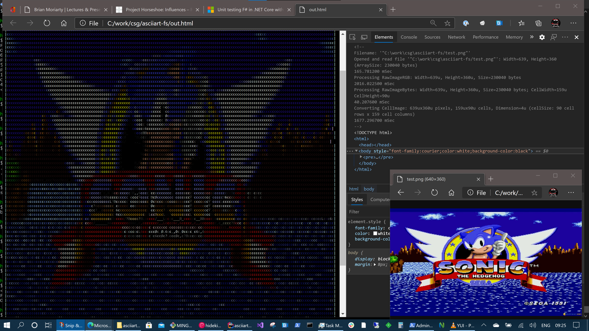

# libAA-FS (ASCII Art F#)
F# training, 2nd self-interested project to learn F#; library to convert PNG (and other images) to ASCII art

## Summary:
* project that can be written quick yet "fun" for learning F#
*

## What have I learned:
* Trust unit-test, not the library which they may claim "stable"; gdi returns width +1
* Array.zeroCreate is your friend; appending to array caused almost infinite loop; for a 640x480 image, it would start off fast, but as it it got about 1/3 scanline, it started to get slower and slower; profiled for memory bloat (not for leaks), etc but no increase in memory was observed; Final assumptions made is that GC cannot keep up, so decided to preallocate and update each pixels 

## Todo:
* Parse arg for in-file and out-file
* optimize
* get ANSI-color working
* 

## Running and Tests
* dotnet test
* run.sh provided for debug runs

